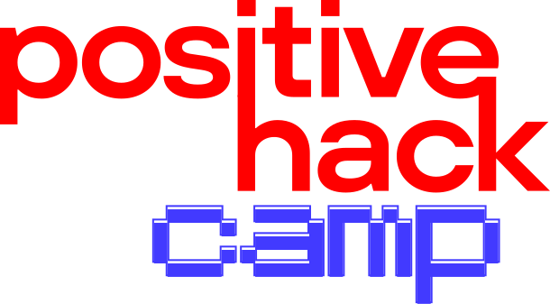
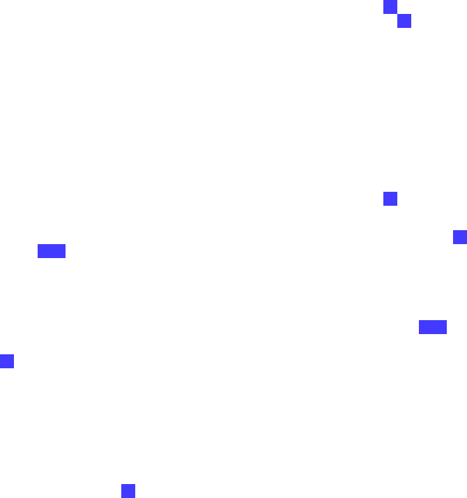

# Positive Hack Bootcamp



Welcome to the **Positive Hack 2025 Bootcamp** repository! In this repository, I curate all you need to know about the comprehensive curriculum of the Positive Hack Bootcamp (White Hat Hacker Professional by CyberED), a walkthrough of all the labs and my preparation notes and tips to pass the [CEWH Certification](https://labs.cyber-ed.ru/certification/CEWH). The CEWH certification is the Russian Ethical Hacking entry-level certification that confirms the knowledge of basic penetration testing, offensive secuirty, and adherence to the White Hackers Code of Ethics. I will also include resources, useful materials, report templates, and more to get you started. Fork the repository (an add a star) if you find it usefull.
---

## Table of Contents

- [Overview](#overview)
- [Repository Structure](#repository-structure)
- [Classes](#classes)
- [Labs](#labs)
- [CEWH Certification](#cewh-certification)
- [Usage Instructions](#usage-instructions)
- [Prerequisites](#prerequisites)
- [Contributing](#contributing)
- [License](#license)
- [Contact](#contact)

---

## Overview

The **Positive Hack Bootcamp 2025** is an immersive, beginner-to-intermediate cybersecurity training program aimed at equipping participants with the knowledge and skills to identify vulnerabilities, secure systems, and contribute to a safer digital world. Through a blend of theoretical classes and practical labs, participants will:

- Learn ethical hacking techniques and defensive security strategies.
- Gain hands-on experience with tools like Wireshark, Metasploit, and Burp Suite.
- Build projects that demonstrate real-world cybersecurity applications.
- Collaborate with peers to solve complex security challenges.

This repository serves as the central hub for all bootcamp materials, including class notes, lab instructions, and supporting resources.

---

## Repository Structure

The repository is organized to provide easy access to all bootcamp materials:

```
positive-hack-bootcamp/
├── classes/                # Lecture notes and slides for each class
├── labs/                   # Lab instructions and supporting files
├── resources/              # Additional tools, scripts, templates, and references
├── docs/                   # Supplemental documentation and guides
└── README.md               # This file
```

---

## Classes

The bootcamp curriculum includes the following classes, each designed to build foundational and advanced cybersecurity knowledge:

1. **Introduction to Cybersecurity**  
   - Topics: Cybersecurity principles, threat landscapes, and ethical hacking basics.  
   - Resources: [Slides](classes/intro-cybersecurity/slides.pdf), [Notes](classes/intro-cybersecurity/notes.md)

2. **Network Security Fundamentals**  
   - Topics: TCP/IP, packet analysis, and network scanning with Nmap.  
   - Resources: [Slides](classes/network-security/slides.pdf), [Cheat Sheet](classes/network-security/nmap-cheatsheet.md)

3. **Web Application Security**  
   - Topics: OWASP Top 10, SQL injection, and XSS vulnerabilities.  
   - Resources: [Slides](classes/web-security/slides.pdf), [Checklist](classes/web-security/owasp-checklist.md)

4. **Secure Coding Practices**  
   - Topics: Writing secure code in Python and JavaScript, input validation, and error handling.  
   - Resources: [Slides](classes/secure-coding/slides.pdf), [Code Samples](classes/secure-coding/examples/)

5. **Incident Response and Forensics**  
   - Topics: Log analysis, incident handling, and digital forensics basics.  
   - Resources: [Slides](classes/incident-response/slides.pdf), [Tools Guide](classes/incident-response/tools.md)

*Note: Replace placeholder links (e.g., `classes/intro-cybersecurity/slides.pdf`) with actual file paths when populating the repository.*

---

## Labs

Labs provide hands-on practice to reinforce class concepts. Each lab includes detailed instructions and deliverables:

1. **Lab 1: Network Scanning with Nmap**  
   - Objective: Perform network reconnaissance using Nmap and document findings.  
   - Files: [Instructions](labs/lab1-nmap/instructions.md), [Sample Output](labs/lab1-nmap/sample-output.txt)  
   - Tools: Nmap, Wireshark

2. **Lab 2: Web Vulnerability Assessment**  
   - Objective: Identify and exploit vulnerabilities in a test web application.  
   - Files: [Instructions](labs/lab2-web-vuln/instructions.md), [Setup Script](labs/lab2-web-vuln/setup.sh)  
   - Tools: Burp Suite, OWASP ZAP

3. **Lab 3: Secure Coding Challenge**  
   - Objective: Develop a secure web form with input validation.  
   - Files: [Instructions](labs/lab3-secure-coding/instructions.md), [Starter Code](labs/lab3-secure-coding/starter.py)  
   - Tools: Python, Flask

4. **Lab 4: Incident Response Simulation**  
   - Objective: Analyze a simulated breach and create an incident report.  
   - Files: [Instructions](labs/lab4-incident-response/instructions.md), [Log Files](labs/lab4-incident-response/logs/)  
   - Tools: Splunk, ELK Stack

*Note: Update file paths and tool versions as needed when adding lab content.*

---

## CEWH Certification



1. **Exam Structure**  
   - Objective: Perform network reconnaissance using Nmap and document findings.  
   - Files: [Instructions](labs/lab1-nmap/instructions.md), [Sample Output](labs/lab1-nmap/sample-output.txt)  
   - Tools: Nmap, Wireshark

## Usage Instructions

To get started with the bootcamp materials:

1. **Clone the Repository**  
   ```bash
   git clone https://github.com/[Your-GitHub-Username]/positive-hack-bootcamp.git
   cd positive-hack-bootcamp
   ```

2. **Set Up Your Environment**  
   Follow the [Prerequisites](#prerequisites) section to install required tools.

3. **Explore Classes and Labs**  
   - Navigate to the `classes/` folder for lecture materials.
   - Visit the `labs/` folder for hands-on exercises.

4. **Run Lab Scripts**  
   Each lab includes a setup script (e.g., `setup.sh`) to configure the environment. Run:
   ```bash
   chmod +x labs/labX/setup.sh
   ./labs/labX/setup.sh
   ```

5. **Submit Deliverables**  
   Follow lab instructions to submit reports or code via pull requests.

---

## Prerequisites

To fully participate in the bootcamp, ensure you have:

- **Hardware**: A laptop with at least 8GB RAM and 20GB free storage.
- **Operating System**: Linux (e.g., Ubuntu 22.04), Windows 10/11, or macOS.
- **Software**:
  - Git: For cloning and managing the repository.
  - Python 3.10+: For secure coding labs.
  - VirtualBox or Docker: For running lab environments.
  - Cybersecurity Tools: Nmap, Wireshark, Burp Suite, Metasploit (specific versions listed in [resources/tools.md](resources/tools.md)).
- **Accounts**:
  - GitHub account for repository access and contributions.
  - [Optional] Acess to the CyberED labs platform for practice (currently under negotiation).

*Note: Replace `[resources/tools.md]` with the actual path to your tools list.*

---

## Contributing

We welcome contributions to improve this repository! To contribute:

1. Fork the repository.
2. Create a new branch (`git checkout -b feature/your-feature`).
3. Make changes and commit (`git commit -m "Add your feature"`).
4. Push to your branch (`git push origin feature/your-feature`).
5. Open a pull request with a clear description of your changes.

Please follow the [Code of Conduct](docs/code-of-conduct.md) and ensure your contributions align with the bootcamp’s goals.

*Note: Add a `code-of-conduct.md` file to the `docs/` folder for reference.*

---

## License

This project is licensed under the MIT License. See the [LICENSE](LICENSE) file for details.

[](https://opensource.org/licenses/MIT)
[](https://github.com/IamdLite/positive-hack-bootcamp/issues)
[](https://github.com/IamdLite/positive-hack-bootcamp/stargazers)

*Note: Replace `[Your-GitHub-Username]` with your actual GitHub username in badge URLs.*

---

## Contact

For questions or support, reach out to:

- **GitHub**: [iamdlite](https://github.com/IamdLite)
- **Email**: [diffouo44@gmail.com](mailto:diffouo44@gmail.com)
- **Bootcamp Organizers**: [Link to official bootcamp website or contact form]

Join the conversation on the official Positive Hack Bootcamp community platform: [Insert community link, e.g., Discord or Slack].


---

*Happy hacking, and let’s make the digital world safer together!*