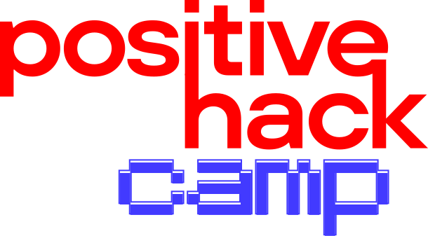

# Positive Hack Bootcamp 2025


---

## Table of Contents

- [Overview](#overview)
- [Repository Structure](#repository-structure)
- [Classes](#classes)
- [Labs](#labs)
- [CEWH Certification](#cewh-certification)
- [Contributing](#contributing)
- [License](#license)
- [Contact](#contact)

---

## Overview

Welcome to the **Positive Hack 2025 Bootcamp** repository! In this repository, I curate all you need to know about the comprehensive curriculum of the [Positive Hack Bootcamp](https://camp.ptsecurity.com) (White Hat Hacker Professional by CyberED), a walkthrough of all the labs, and my preparation notes and tips to pass the [CEWH Certification](https://labs.cyber-ed.ru/certification/CEWH) with colors ^^. 

The CEWH certification is the Russian Ethical Hacking entry-level certification that confirms knowledge of basic penetration testing, offensive security, and adherence to the White Hackers Code of Ethics. I will also include resources, useful materials, report templates, and more to get you started. Fork the repository (and add a star) if you find it useful!

- [ ] Learn ethical hacking techniques and defensive security strategies.
- [ ] Gain hands-on experience with tools like BloodHound, Metasploit, and Burp Suite.
- [ ] Build projects that demonstrate real-world cybersecurity applications.
- [ ] Learn how to report red team operations and penetration testing engagements.

---

## Repository Structure

The repository is organized to provide easy access to all bootcamp materials:

```
positive-hack-bootcamp/
├── assessments/       # Knowlegde check quizzes, CEWH exam tips and cheat sheet     
├── classes/           # Lecture notes and slides for each class
├── labs/              # Lab instructions and supporting files
├── resources/         # Additional tools, manuals, exploits, (report) templates, and references
└── README.md          # This file
```

---

## Classes and Labs

The bootcamp curriculum includes the following classes, each designed to build foundational and advanced cybersecurity knowledge:

1. **Exploration in the Customers External Infrastructure**  
   - Topics: Cybersecurity principles, threat landscapes, and ethical hacking basics.  
   - Resources: [Slides](classes/Lesson%201), [Labs](labs/day%201)

2. **Hacking Web Applications**  
   - Topics: TCP/IP, packet analysis, and network scanning with Nmap.  
   - Resources: [Slides](classes/Lesson%202), [Labs](labs/day%202)

3. **Exploring Known Vulnerabilities in Network Services**  
   - Topics: OWASP Top 10, SQL injection, and XSS vulnerabilities.  
   - Resources: [Slides](classes/Lesson%203), [Labs](labs/day%203)

4. **Social Engineering**  
   - Topics: Writing secure code in Python and JavaScript, input validation, and error handling.  
   - Resources: [Slides](classes/Lesson%204), [Labs](labs/day%204)

5. **Privilege Escalation on Server Systems**  
   - Topics: Log analysis, incident handling, and digital forensics basics.  
   - Resources: [Slides](classes/Lesson%205), [Labs](labs/day%205)

6. **Network Pivoting**  
   - Topics: Log analysis, incident handling, and digital forensics basics.  
   - Resources: [Slides](classes/Lesson%206), [Labs](labs/day%206)

7. **Privilege Escalation on Local Nodes**  
   - Topics: Log analysis, incident handling, and digital forensics basics.  
   - Resources: [Slides](classes/Lesson%207), [Labs](labs/day%207)

8. **Network Reconnaissance and Compromise**  
   - Topics: Log analysis, incident handling, and digital forensics basics.  
   - Resources: [Slides](classes/Lesson%208), [Labs](labs/day%208)

*Note: Replace placeholder links (e.g., `classes/intro-cybersecurity/slides.pdf`) with actual file paths when populating the repository.*

---

## CEWH Certification

The **Certified Ethical White Hacker (CEWH)** certification validates skills in penetration testing, offensive security, and adherence to ethical hacking principles. Below is an overview of the certification process based on the bootcamp:

1. **Exam Structure**  
   - **Format**: Practical exam with real-world scenarios, including network reconnaissance, vulnerability assessment, and report writing.  
   - **Duration**: 4 hours.  
   - **Tools**: Nmap, Wireshark, Metasploit, Burp Suite (same as lab tools).  
   - **Resources**: [CEWH Study Guide](assessments/CEWH), [Sample Report Template](resources/reporting)  
   - **Objective**: Demonstrate proficiency in identifying vulnerabilities, exploiting them ethically, and documenting findings per the White Hackers Code of Ethics.

2. **Preparation Tips**  
   - Complete all labs in the `labs/` folder to practice exam scenarios.  
   - Review class notes in the `classes/` folder for theoretical knowledge.  
   - Use [resources/cewh-tips.md](assessments/CEWH) for additional strategies and practice questions.

3. **Certification Benefits**  
   - Validates entry-level ethical hacking skills recognized in the cybersecurity industry.  
   - Prepares you for advanced certifications like CEH or OSCP.  
   - Enhances your portfolio with practical, documented projects.

*Note: Replace placeholder links (e.g., `resources/cewh-study-guide.md`) with actual file paths when available.*

---

## Contributing

You are welcome to contribute to improve this repository! Contributions can be anything from typos, to fixes in the labs or lectures, or additional of tools or methods. To contribute:

1. Fork the repository.  
2. Create a new branch (`git checkout -b issue/your-issue`).  
3. Make changes and commit (`git commit -m "Add your contribution"`).  
4. Push to your branch (`git push origin issue/your-issue`).  
5. Open a pull request with a clear description of your changes.


---

## License

This project is licensed under the MIT License. See the [LICENSE](LICENSE) file for details.

[](https://opensource.org/licenses/MIT)
[](https://github.com/IamdLite/positive-hack-bootcamp/issues)
[](https://github.com/IamdLite/positive-hack-bootcamp/stargazers)

*Note: Replace `[Your-GitHub-Username]` with your actual GitHub username in badge URLs.*

---

## Contact

For questions or support, reach out to:

- **GitHub**: [iamdlite](https://github.com/IamdLite)  
- **Email**: [diffouo44@gmail.com](mailto:diffouo44@gmail.com)  
- **Bootcamp Organizers**: [Positive Hack Bootcamp Website](https://camp.ptsecurity.com)

Don't forget to follow Positive Technologies on social media to apply for the next Positive Hack Bootcamp!'

---

*The Learning Materials and Some Resources Shared in this repository belong to Positive Technologies, Sigleton Security, and CyberED. Happy Hacking!*